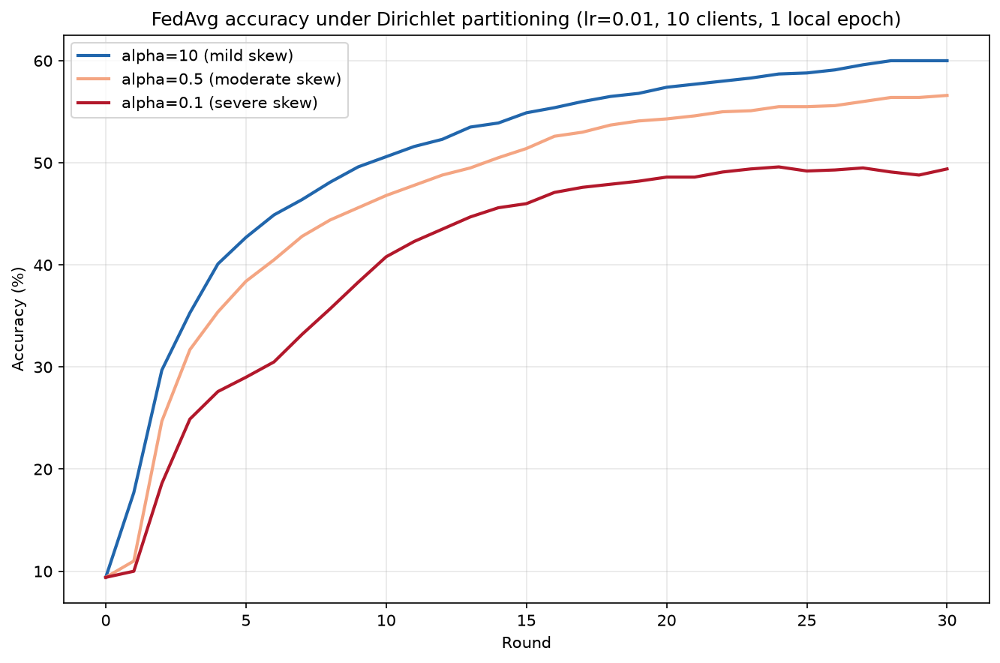
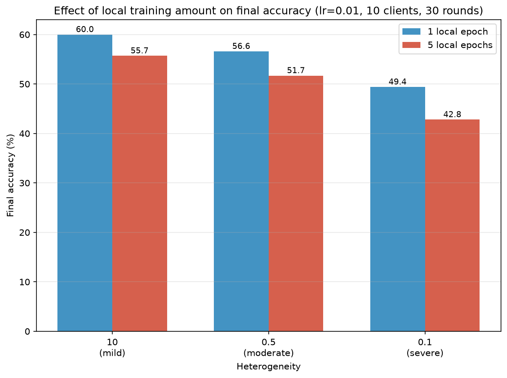

# Federated Learning under Data Heterogeneity

Measuring how FedAvg behaves as client data becomes non-IID, using Flower with Dirichlet partitioning
on CIFAR-10, and how that interacts with learning rate and the amount of local training per round.

## Setup

- Flower 1.33, PyTorch quickstart template as the starting scaffold
- CIFAR-10, small CNN (2 conv + 3 fc), FedAvg
- 10 simulated clients, 30 rounds, SGD with momentum 0.9, seed 1
- Dirichlet partitioning by label, alpha in {10, 0.5, 0.1}
- Metric: centralised accuracy on the full CIFAR-10 test set, evaluated server-side each round

Lower alpha means more severe label skew across clients. Full per-round curves for every run are in
[results/raw_results.md](results/raw_results.md).

## Findings

### 1. Accuracy degrades monotonically with heterogeneity

At lr=0.01 with 1 local epoch, final accuracy after 30 rounds:

| alpha | final accuracy |
|---|---|
| 10 (mild) | 60.0 |
| 0.5 (moderate) | 56.6 |
| 0.1 (severe) | 49.4 |

The gap widens as skew increases: mild to moderate costs 3.4 points, moderate to severe costs 7.2.
Convergence speed degrades too. alpha=10 passes 50 percent by round 10, alpha=0.5 by round 15, and
alpha=0.1 never does.

### 2. A poorly tuned learning rate hides the effect

The same sweep at lr=0.1:

| alpha | lr=0.01 | lr=0.1 |
|---|---|---|
| 10 | 60.0 | 29.2 |
| 0.5 | 56.6 | 29.1 |
| 0.1 | 49.4 | 18.0 |

At lr=0.1 the mild and moderate conditions become indistinguishable (29.2 versus 29.1), so the
heterogeneity effect is invisible between them. Severe skew still shows through at 18.0. Before
attributing a result to federation dynamics, it is worth checking that the optimizer is not the
binding constraint.

### 3. More local training per round converges faster but reaches a lower ceiling

At lr=0.01, comparing 1 versus 5 local epochs per round:

| local epochs | alpha=10 | alpha=0.5 | alpha=0.1 |
|---|---|---|---|
| 1 | 60.0 | 56.6 | 49.4 |
| 5 | 55.7 | 51.7 | 42.8 |
| difference | -4.3 | -4.9 | -6.6 |

The penalty grows with heterogeneity. All three 5-epoch runs climb quickly, peak early, then decline
while training loss keeps falling and evaluation loss rises. At alpha=0.1 training loss reaches 0.094
while evaluation loss reaches 2.89, higher than the untrained model's 2.30: clients fit their narrow
local label distributions well and the averaged global model generalises worse.

Note this compares equal round counts, not equal total local computation. The 5-epoch runs perform
five times more local work overall.

## Reproducibility

Seeds are fixed for model initialisation, data shuffling, and the Dirichlet partition. Repeating a
configuration produced bit-identical results on every occasion this was tested.

Client count must be passed explicitly. Flower's stored simulation config reverted to its default of
2 SuperNodes partway through one session, which silently changed a variable mid-experiment. A
controlled check at alpha=10, lr=0.1 gives 22.7 with 2 clients versus 29.2 with 10, so federation size
alone accounts for several points.

## Limitations and next steps

- Single seed for the reported sweeps. Multiple seeds per condition would allow error bars.
- Only FedAvg. Whether an adaptive server strategy such as FedAdagrad recovers performance at
  alpha=0.1 is untested.
- Whether the heterogeneity penalty scales with federation size is untested beyond the 2-versus-10
  client check.
- The local-epochs comparison holds rounds constant rather than total local computation.

## Running it

Install dependencies and run:

    pip install -r requirements.txt
    flwr run . --stream --federation-config="num-supernodes=10"

Alpha is set in `pytorchexample/task.py` (the `DirichletPartitioner` call). Rounds, learning rate, and
local epochs are in `pyproject.toml`.

Built on Flower's PyTorch quickstart template.